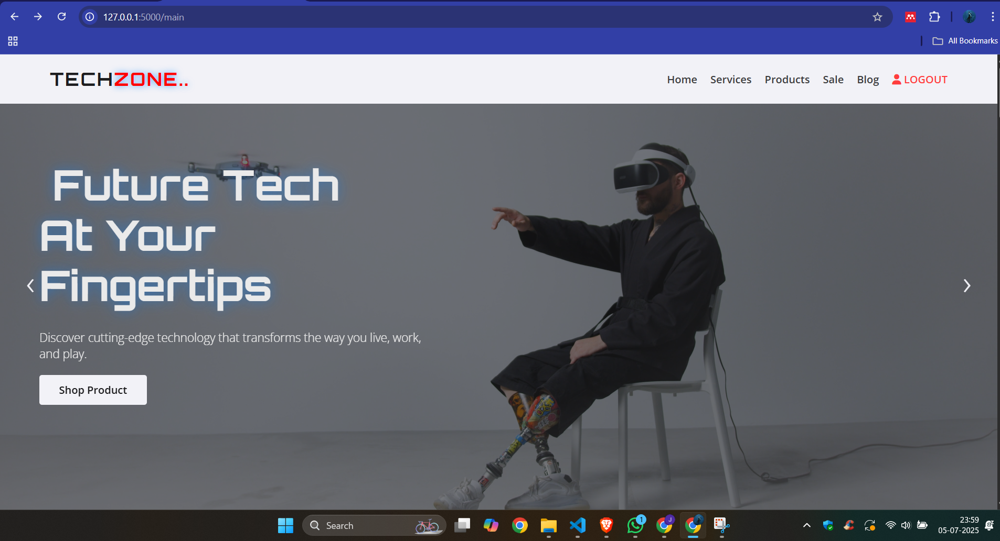
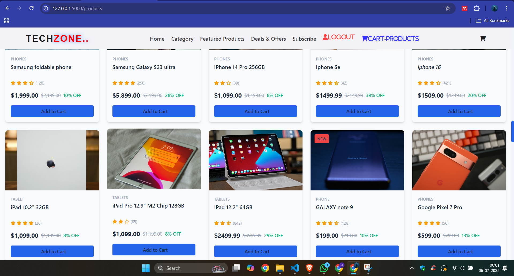
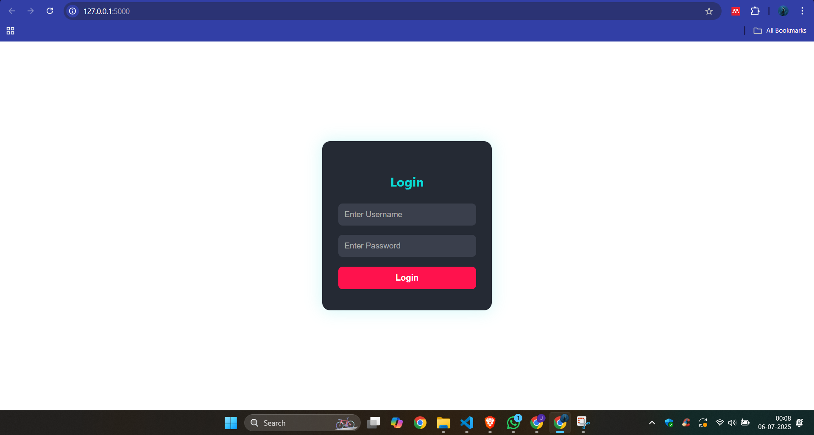

# TechZone

TechZone is a modern e-commerce web application for discovering and purchasing the latest tech gadgets, electronics, and accessories. It features a stylish UI, product catalog, shopping cart, and user authentication, all built with Python and Flask.

## Features

- Responsive landing page with hero section and product highlights
- Product catalog with categories, ratings, and discounts
- Shopping cart functionality
- User authentication (login, verification)
- Newsletter signup
- Modern UI with custom CSS and FontAwesome icons
- Static assets for images and videos

## Project Structure

```
.
├── app.py
├── requirements.txt
├── static/
│   ├── style.css
│   └── images/
├── templates/
│   ├── index.html
│   ├── login.html
│   ├── main.html
│   ├── products.html
│   └── verification.html
└── ...
```

---

## 🔐 Demo Credentials

- **Username**: `tech1`
- **Password**: `virtual@123`

---

## 🧑‍💻 Tech Stack

| Layer      | Technology Used           |
|------------|----------------------------|
| Frontend   | HTML, CSS, JavaScript      |
| Backend    | Python (Flask)             |
| Styling    | Custom CSS, FontAwesome    |
| Email      | Gmail SMTP (real-time)     |
| Deployment | Gunicorn / Waitress / Flask-Cors |

---

## Getting Started

### Prerequisites

- Python 3.8+
- [pip](https://pip.pypa.io/en/stable/)

### Installation

1. Clone the repository:
    ```sh
    git clone https://github.com/yourusername/techzone.git
    cd techzone
    ```

2. Install dependencies:
    ```sh
    pip install -r requirements.txt
    ```

### Running the App

Start the Flask development server:
```sh
python app.py
```
The app will be available at [http://localhost:5000](http://localhost:5000).

### Deployment

You can deploy using Gunicorn or Waitress as configured in `requirements.txt`.

## Screenshots






## License

This project is licensed under the MIT License.

---

**Discover the Future of Smart Tech Today with TechZone!**
